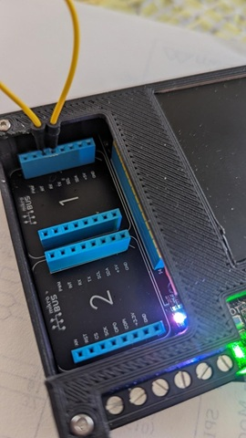

# Meadow.ProjectLab.Extensions

Extended demo projects for Meadow ProjectLab.

  
**_The WILDERNESS LABS Project Lab V3 board_**

## Links
- The target board:  [The Wilderness Labs project V3](https://store.wildernesslabs.co/collections/frontpage/products/project-lab-board)
- [Meadow ProjectLab_Demo](https://github.com/WildernessLabs/Meadow.ProjectLab/tree/main/Source/)
- [WildernessLabs/Meadow.ProjectLab](https://github.com/WildernessLabs/Meadow.ProjectLab)
- [Meadow ProjectLab Samples](https://github.com/WildernessLabs/Meadow.ProjectLab.Samples)
- [Meadow.Core.Samples](https://github.com/WildernessLabs/Meadow.Core.Samples)
- [Meadow.Foundation.Grove](https://github.com/WildernessLabs/Meadow.Foundation.Grove)

> Nb: Currently .netstandard2.1 projects

## WiFi Demo

This project is based upon the [Meadow ProjectLab_Demo](https://github.com/WildernessLabs/Meadow.ProjectLab/tree/main/Source/). It needs the project **Meadow.ProjectLab** located with that project. _(You need to clone that GitHub project and then add the Meadow.ProjectLab project as a project reference to this project.)_ 

The WiFi functionality is based upon the [Meadow.Core.Samples WiFi_Basics](https://github.com/WildernessLabs/Meadow.Core.Samples/tree/main/Source/Network/WiFi_Basics/CS) project. 
> This project demonstrates using the display in a reusable manner, as a menu. The user selects a network from the locally found WiFi access poinst and then selects from a given list of passwords.

### Further Links
- [UeberDaniel/Meadow-Ws2812Display-Driver](https://github.com/UeberDaniel/Meadow-Ws2812Display-Driver)
- Alternative approach: [MicroLayout Library](http://developer.wildernesslabs.co/Meadow/Meadow.Foundation/Libraries_and_Frameworks/MicroLayout/)

## SerialPort_Echo

Demonstrates loopback serial transmission.  
- Uses COM1. 
- Jumper COM1 Tx to Rx in mikroBUS socket 1 _(Not socket2)_
- Adapted from **[Meadow.Core.Samples]/IO/SerialPort_Echo project**

#### Update: Version 2

- Alternatively define **EchoToTerminal**
  - Requires Serial connection from COM1 to PC running Serial Terminal (eg Putty).
    - 115200 BAUD
  - For example use USB-Serial connection with COM1 as shown:  

## Grove Digital IO and Analog In 

***Project:* DigitalIO**  

Toggle an LED with a pushbutton
- Connect Grove LED to Grove UART socket on right of ProjectLab
- Connect Grove Pushbutton to Grove Digital socket on right of ProjectLab
- Ref: [Meadow_Basics/IO/Digital/](http://developer.wildernesslabs.co/Meadow/Meadow_Basics/IO/Digital/)

#### Alternatives
- The LED can be replaced with the Grove Buzzer, or the Grove Relay etc.
- The Grove Touch sensor can be used instead of the pushbutton.

### Analog In (Update V2)
Simple voltage reading, nonevent driven.
- Add Grove Angle Sensor (Potentiometer) (or similar) to Grove Analog Socket on ProjectLab right
- Ref: [Meadow_Basics/IO/Analog/](http://developer.wildernesslabs.co/Meadow/Meadow_Basics/IO/Analog/)

## MulticolorLED
Toggle LED between Blue-Green-Red
- Uses onboard Tricolor LED near mikriBUS socket 2
- Add Grove Pushbutton (or sililar) to GHrove Digital socket on ProjectLab right.

